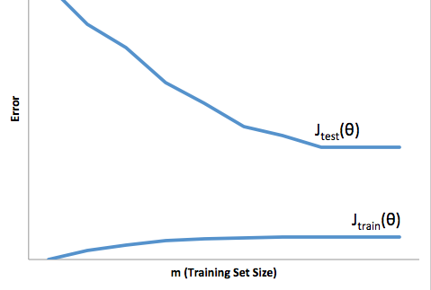

# Week 6

## 1° Quiz

### Author: Fernando Barranco Rodríguez

---

**1. You train a learning algorithm, and find that it has unacceptably high error on the test set. You plot the learning curve, and obtain the figure below. Is the algorithm suffering from high bias, high variance, or neither?**

* High variance

**2. Suppose you have implemented regularized logistic regression to classify what object is in an image (i.e., to do object recognition). However, when you test your hypothesis on a new set of images, you find that it makes unacceptably large errors with its predictions on the new images. However, your hypothesis performs well (has low error) on the training set. Which of the following are promising steps to take? Check all that apply.**

* Try using a smaller set of features.

* Try increasing the regularization parameter λ.

**3. Suppose you have implemented regularized logistic regression to predict what items customers will purchase on a web shopping site. However, when you test your hypothesis on a new set of customers, you find that it makes unacceptably large errors in its predictions. Furthermore, the hypothesis performs poorly on the training set. Which of the following might be promising steps to take? Check all that apply.**

* Try adding polynomial features.

* Try decreasing the regularization parameter λ.

**4. Which of the following statements are true? Check all that apply.**

* Suppose you are using linear regression to predict housing prices, and your dataset comes sorted in order of increasing sizes of houses. It is then important to randomly shuffle the dataset before splitting it into training, validation and test sets, so that we don’t have all the smallest houses going into the training set, and all the largest houses going into the test set.

* A typical split of a dataset into training, validation and test sets might be 60% training set, 20% validation set, and 20% test set.

**5. Which of the following statements are true? Check all that apply.**

* When debugging learning algorithms, it is useful to plot a learning curve to understand if there is a high bias or high variance problem.

* A model with more parameters is more prone to overfitting and typically has higher variance.

* If a learning algorithm is suffering from high bias, only adding more training examples may not improve the test error significantly.

