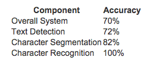

# Week 11

## 1° Quiz

### Author: Fernando Barranco Rodríguez

---

**1. Suppose you are running a sliding window detector to find text in images. Your input images are 1000x1000 pixels. You will run your sliding windows detector at two scales, 10x10 and 20x20 (i.e., you will run your classifier on lots of 10x10 patches to decide if they contain text or not; and also on lots of 20x20 patches), and you will "step" your detector by 2 pixels each time. About how many times will you end up running your classifier on a single 1000x1000 test set image?**

* 500,000

**2. Suppose that you just joined a product team that has been developing a machine learning application, using m=1,000 training examples. You discover that you have the option of hiring additional personnel to help collect and label data. You estimate that you would have to pay each of the labellers $10 per hour, and that each labeller can label 4 examples per minute. About how much will it cost to hire labellers to label 10,000 new training examples?**

* $400

**3. What are the benefits of performing a ceiling analysis? Check all that apply.**

* It can help indicate that certain components of a system might not be worth a significant amount of work improving, because even if it had perfect performance its impact on the overall system may be small.

* It helps us decide on allocation of resources in terms of which component in a machine learning pipeline to spend more effort on.

* It gives us information about which components, if improved, are most likely to have a significant impact on the performance of the final system.

**4. Suppose you are building an object classifier, that takes as input an image, and recognizes that image as either containing a car (y=1) or not (y=0). For example, here are a positive example and a negative example:**

**After carefully analyzing the performance of your algorithm, you conclude that you need more positive (y=1) training examples. Which of the following might be a good way to get additional positive examples?**

* Mirror your training images across the vertical axis (so that a left-facing car now becomes a right-facing one).

**5. Suppose you have a PhotoOCR system, where you have the following pipeline:**

**You have decided to perform a ceiling analysis on this system, and find the following:**

**Which of the following statements are true?**

* The potential benefit to having a significantly improved text detection system is small, and thus it may not be worth significant effort trying to improve it.

* If we conclude that the character recognition's errors are mostly due to the character recognition system having high variance, then it may be worth significant effort obtaining additional training data for character recognition.

