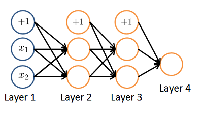

# Week 4

## 1° Quiz

### Author: Fernando Barranco Rodríguez

---

**1. Which of the following statements are true? Check all that apply.**

* The activation values of the hidden units in a neural network, with the sigmoid activation function applied at every layer, are always in the range (0, 1).

* Any logical function over binary-valued (0 or 1) inputs x1 and x2 can be (approximately) represented using some neural network.

**2. Consider the following neural network which takes two binary-valued inputs x1,x2∈{0,1} and outputs hΘ(x). Which of the following logical functions does it (approximately) compute?**

* OR

**3. Consider the neural network given below. Which of the following equations correctly computes the activation a(3)1? Note: g(z) is the sigmoid activation function.**

* a(3)1 = g( Θ(2)1, 0a(2)0 + Θ(2)1, 1a(2)1 + Θ(2)1, 2a(2)2 )

**4. You have the following neural network:**

**You'd like to compute the activations of the hidden layer a(2)∈R3. One way to do so is the following Octave code:**

**You want to have a vectorized implementation of this (i.e., one that does not use for loops). Which of the following implementations correctly compute a(2)? Check all that apply.**

* z = Theta1 * x; a2 = sigmoid (z);

**5. You are using the neural network pictured below and have learned the parameters Θ(1)=[1111.72.43.2] (used to compute a(2)) and Θ(2)=[10.3−1.2] (used to compute a(3)} as a function of a(2)). Suppose you swap the parameters for the first hidden layer between its two units so Θ(1)=[111.713.22.4] and also swap the output layer so Θ(2)=[1−1.20.3]. How will this change the value of the output hΘ(x)?**

* It will stay the same.

