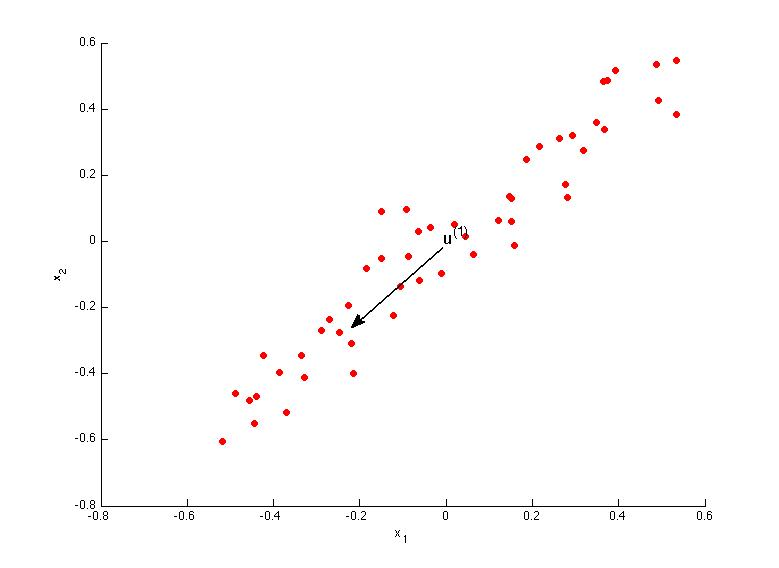
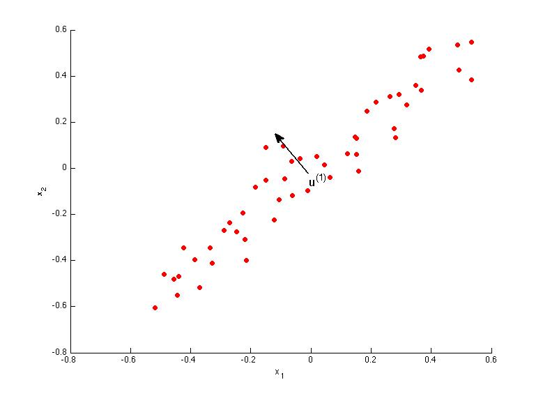

# Week 8

## 2° Quiz

### Author: Fernando Barranco Rodríguez

---

**1. Consider the following 2D dataset:**

**Which of the following figures correspond to possible values that PCA may return for u(1) (the first eigenvector / first principal component)? Check all that apply (you may have to check more than one figure).**

Figure 1

Figure 2

Figure 3

Figure 4

* Figure 1

* Figure 2

**2. Which of the following is a reasonable way to select the number of principal components k? (Recall that n is the dimensionality of the input data and m is the number of input examples.)**

* Choose k to be the smallest value so that at least 99% of the variance is retained.

**3. Suppose someone tells you that they ran PCA in such a way that "95% of the variance was retained." What is an equivalent statement to this?**

* (1/m*∑{i=1,m}||x(i)−x(i)approx||^2) / (1/m*∑{i=1,m}||x(i)||^2) ≤ 0.05

**4. Which of the following statements are true? Check all that apply.**

* Given an input x∈R^n, PCA compresses it to a lower-dimensional vector z∈R^k.

* If the input features are on very different scales, it is a good idea to perform feature scaling before applying PCA.

**5. Which of the following are recommended applications of PCA? Select all that apply.**

* Data compression: Reduce the dimension of your input data x(i), which will be used in a supervised learning algorithm (i.e., use PCA so that your supervised learning algorithm runs faster).

* Data visualization: Reduce data to 2D (or 3D) so that it can be plotted.

